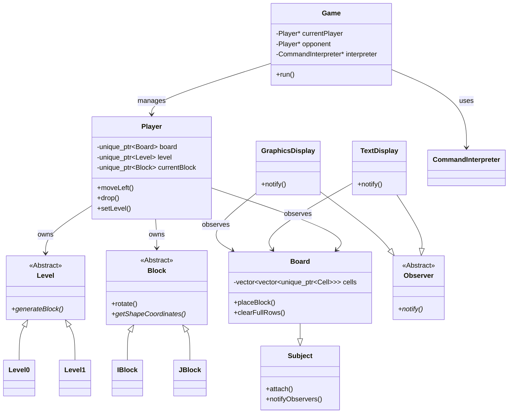

# Biquadris Design Document

## 1. Introduction
Biquadris is a two-player, competitive implementation of the classic Tetris game. The project focuses on modular design, extensibility, and the application of object-oriented design patterns to manage game complexity. The system supports multiple difficulty levels, special effects, and both text and graphical user interfaces.

## 2. Overview
The project is structured around a central `Game` controller that manages the main loop and two `Player` instances. Each `Player` encapsulates their own game state, including a `Board` (grid), `Score`, and current `Level`.

*   **Game**: The top-level controller. It initializes the game, manages the turn-based loop, and routes user input to the active player.
*   **Player**: Represents a single player. It owns a `Board`, a `Level` strategy, and manages the lifecycle of `Block`s (creation, movement, placement).
*   **Board**: Represents the 11x18 grid. It manages `Cell`s and placed `Block`s. It acts as a `Subject` in the Observer pattern.
*   **Level**: An abstract base class defining the strategy for block generation. Subclasses (`Level0` to `Level4`) implement specific generation rules.
*   **Block**: An abstract base class for tetrominoes (`I`, `J`, `L`, `O`, `S`, `Z`, `T`, `*`). It manages its own position, orientation, and cells.
*   **Display**: `TextDisplay` and `GraphicsDisplay` are observers that render the state of the `Board`.
*   **CommandInterpreter**: Parses user input and executes commands on the `Player`.

### Architecture Diagram


## 3. Updated UML
The final design closely follows the initial plan but with refined ownership using smart pointers.

*   **Game**: Owns `Player`s (unique_ptr).
*   **Player**: Owns `Board` (unique_ptr), `Level` (unique_ptr), `Block`s (unique_ptr).
*   **Board**: Inherits `Subject`. Owns `Cell`s (unique_ptr). Stores raw pointers to placed `Block`s for quick access.
*   **Level**: Abstract Strategy. Subclasses: `Level0` (scripted), `Level1` (random weighted), `Level2`, `Level3`, `Level4`.
*   **Block**: Abstract Product. Subclasses: `IBlock`, `JBlock`, `LBlock`, `OBlock`, `SBlock`, `ZBlock`, `TBlock`, `StarBlock`.
*   **SpecialAction**: Abstract Command. Subclasses: `BlindAction`, `HeavyAction`, `ForceAction`.
*   **CommandInterpreter**: Helper class for parsing.

## 4. Design

### 4.1 Observer Pattern
*   **Subject**: `Board`
*   **Observer**: `TextDisplay`, `GraphicsDisplay`
*   **Justification**: The `Board` (Model) should not know how it is being displayed. The Observer pattern allows multiple views (Text, Graphics) to update automatically when the board state changes (blocks moved, rows cleared) without coupling the Board to specific display logic.
*   **Implementation**: `Board` inherits from `Subject`. `TextDisplay` and `GraphicsDisplay` inherit from `Observer`. When `Board::placeBlock` or `Board::clearFullRows` occurs, `Board::notifyObservers()` is called.

### 4.2 Factory Method Pattern
*   **Creator**: `Level` (Abstract), `Level0`...`Level4` (Concrete)
*   **Product**: `Block` (Abstract), `IBlock`...`StarBlock` (Concrete)
*   **Method**: `virtual unique_ptr<Block> generateBlock() = 0;`
*   **Justification**: Different levels have different rules for creating blocks (probabilities, sequences). The Factory Method allows the `Player` to request a block via `level->generateBlock()` without knowing *how* it is created or exactly *which* subclass is instantiated.

### 4.3 Strategy Pattern
*   **Context**: `Player`
*   **Strategy**: `Level`
*   **Justification**: The behavior of block generation changes dynamically based on the difficulty level. By encapsulating this algorithm in the `Level` interface, the `Player` can switch strategies at runtime (e.g., `levelup` command) by simply replacing the `Level` object.

### 4.4 Command Pattern
*   **Command**: `SpecialAction` (Abstract)
*   **Concrete Commands**: `BlindAction`, `HeavyAction`, `ForceAction`
*   **Invoker**: `Game`
*   **Receiver**: `Player`
*   **Justification**: Special actions are effects applied to a player. Encapsulating them as objects allows the `Game` to treat all special actions uniformly (`action->apply(opponent)`) and easily extend the system with new actions without modifying the `Game` logic.

### 4.5 MVC (Model-View-Controller)
*   **Model**: `Board`, `Player`, `Block`, `Level` (Game logic and state)
*   **View**: `TextDisplay`, `GraphicsDisplay` (Presentation)
*   **Controller**: `Game`, `CommandInterpreter` (Input handling)
*   **Justification**: Separates concerns. The game logic is independent of the user interface, making it easier to test and modify.

## 5. Resilience to Change

### 5.1 Cohesion and Coupling Analysis
*   **Cohesion**:
    *   **Board**: High cohesion. It strictly manages the grid, cell occupancy, and row clearing. It does not handle scoring or input.
    *   **Player**: High cohesion. It manages the rules of the game for one person (score, level, current block).
    *   **Level**: High cohesion. It focuses solely on generating the next block.
*   **Coupling**:
    *   **Player -> Level**: Low coupling. `Player` depends only on the abstract `Level` class. Adding `Level5` requires no changes to `Player`.
    *   **Display -> Board**: Low coupling. Displays depend on the `Subject` interface (mostly) and read-only access to `Board`.
    *   **Game -> Player**: Tighter coupling, but necessary as `Game` orchestrates the turn.

**Recompilation Analysis**:
*   Adding a new `Block` subclass only requires recompiling `Level` implementations (the factory) and the new block file. `Player` and `Board` work with the abstract `Block` and don't need recompilation.
*   Adding a new `Level` only requires recompiling `Player`'s factory method (if hardcoded) or just the main setup.

### 5.2 Q1: Disappearing Blocks
**Question**: "How could you design your system to allow for some generated blocks to disappear from the screen if not cleared before 10 more blocks have fallen?"

**Answer**:
We can introduce a `TimerBlock` subclass (or a decorator) that tracks a `turnsExisting` counter.
*   **Changes**:
    *   Create `class TimerBlock : public Block`.
    *   Add `virtual void onTurnEnd()` to `Block` (default empty).
    *   In `TimerBlock::onTurnEnd()`, increment counter. If > 10, mark for removal.
    *   In `Player::drop()`, iterate `allBlocks` and call `onTurnEnd()`.
*   **Specifics**:
    *   `Block.cc`: Add `virtual void tick() {}`.
    *   `Player.cc`: In `drop()`, loop through `allBlocks` and call `tick()`.
    *   `TimerBlock.cc`: Implement `tick()` to check condition and remove self from `Board`.
*   **Why Good Design**: This uses polymorphism. The `Player` doesn't need to know which blocks are timer blocks; it just notifies all blocks that a turn passed.

### 5.3 Q2: Additional Levels
**Question**: "How could you design your program to accommodate the possibility of introducing additional levels into the system, with minimum recompilation?"

**Answer**:
Our use of the **Strategy Pattern** and **Factory Method** makes this trivial.
*   **Changes**:
    *   Create `class Level5 : public Level`.
    *   Implement `generateBlock()` in `Level5`.
    *   Update `Player::createLevel` (the factory) to recognize level 5.
*   **Unchanged**: `Board`, `Block`, `Game`, `TextDisplay`.
*   **Code**:
    ```cpp
    // player-impl.cc
    unique_ptr<Level> Player::createLevel(int levelNum, ...) {
        // ... existing levels ...
        if (levelNum == 5) return make_unique<Level5>(...);
    }
    ```
*   **Why Good Design**: `Player` logic for movement, scoring, and dropping is completely decoupled from *how* blocks are generated.

### 5.4 Q3: Multiple Simultaneous Effects
**Question**: "How could you design your program to allow for multiple effects to applied simultaneously?"

**Answer**:
Currently, `Player` has boolean flags (`isBlind`) and counters (`heavyEffect`). To support arbitrary combinations without `else-if` chains, we can use a **Decorator Pattern** on the `Player` or a list of **Effect** objects.
*   **Changes**:
    *   Define `class Effect { virtual void apply(Player*) = 0; }`.
    *   `Player` holds `vector<unique_ptr<Effect>> activeEffects`.
    *   When an event happens (e.g., `move`), iterate through `activeEffects`.
*   **Specifics**:
    *   `HeavyEffect` and `BlindEffect` become classes.
    *   `Player::moveLeft()` calls `applyEffects("move")`.
*   **Why Good Design**: Replaces hardcoded flags with a dynamic list. New effects can be added without modifying `Player`'s core logic.

### 5.5 Q4: New Commands and Macros
**Question**: "How could you design your system to accommodate the addition of new command names... or support a 'macro' language?"

**Answer**:
The `CommandInterpreter` uses a `std::map<string, string>` to resolve commands.
*   **New Commands**: Simply add a new entry to the map in `CommandInterpreter::CommandInitialise()`. No logic change needed in parsing.
*   **Renaming**: Add a command `rename old new` that updates the map: `commandMap[new] = commandMap[old]; commandMap.erase(old);`.
*   **Macros**:
    *   Add a `MacroCommand` class or simply a map `map<string, vector<string>> macros`.
    *   When a macro name is typed, the interpreter looks it up and pushes the sequence of commands into a processing queue.
*   **Why Good Design**: The command parsing is data-driven (via the map) rather than hardcoded logic.

### 5.6 Other Changes
1.  **New Block Shapes**: Create `class Pentomino : public Block`. Implement `getShapeCoordinates`. Update `Level` to generate it. `Board` handles it automatically.
2.  **Changing Board Size**: `Board` constants `WIDTH` and `HEIGHT` are defined in `Board.cc`. Change these values. `vector`s resize dynamically.
3.  **Network Multiplayer**: Create `NetworkDisplay : public Observer`. It sends board state over socket in `notify()`. `Game` reads input from socket.

## 6. Answers to Questions from Project
(See Section 5.2 - 5.5 above for detailed answers)

## 7. Extra Credit Features
### Memory Management Challenge (4 marks)
*   **Status**: **Complete project without explicit memory management**.
*   **Implementation**:
    *   `unique_ptr` used for all ownership: `Player` owns `Board`, `Level`, `Block`s. `Board` owns `Cell`s.
    *   `shared_ptr` not needed as ownership is strictly hierarchical.
    *   **No `delete` statements anywhere** in the codebase.
    *   **No memory leaks**: Resources are automatically cleaned up when `unique_ptr`s go out of scope (e.g., when `Player` is reset or `Game` ends).
*   **Challenges**:
    *   **Observer Pattern**: Observers (`TextDisplay`) need access to `Board` but shouldn't own it. We used raw pointers for observers, which is safe because `Board` outlives the displays (managed by `Game`).
    *   **Polymorphism**: `unique_ptr<Block>` allows storing different block types in `vector<unique_ptr<Block>>` while handling cleanup correctly via virtual destructors.

## 8. Final Questions

### Q1: Lessons Learned
1.  **Importance of Interfaces**: Defining `Level` and `Block` as abstract base classes early on allowed us to work on `Board` and `Player` logic without worrying about specific implementation details.
2.  **Modular Testing**: By separating `Board` logic from `Game` loop, we could test row clearing and placement independently of user input.
3.  **Smart Pointers simplify life**: Using `unique_ptr` eliminated an entire class of bugs (memory leaks, double frees) that are common in C++.

### Q2: What would you do differently?
1.  **Better Event System**: Instead of a simple Observer, a full Event Bus might have been better for complex interactions (e.g., sound, achievements, complex special effects).
2.  **Unit Tests**: We relied on manual testing. Writing unit tests (e.g., using Google Test) for `Board::clearFullRows` would have caught the Star Block bug earlier.
3.  **Decoupling Input**: The `CommandInterpreter` is slightly coupled to `Player`. A pure Command pattern (returning Command objects) would have been cleaner for implementing Undo/Redo.

## 9. Conclusion
The Biquadris project demonstrates a robust, object-oriented architecture. By leveraging patterns like Observer, Strategy, and Factory Method, we created a system that is both stable and easy to extend. The strict adherence to RAII and smart pointers ensures memory safety, making the codebase maintainable and modern.
