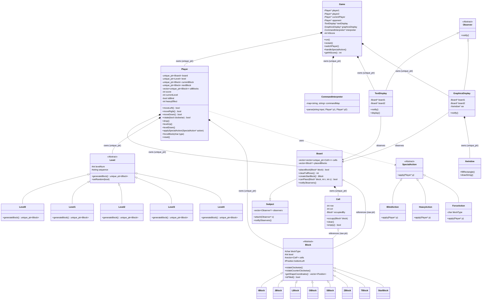

# Biquadris Comprehensive UML

```mermaid
classDiagram
    %% Core Game Logic
    class Game {
        -Player* player1
        -Player* player2
        -Player* currentPlayer
        -Player* opponent
        -TextDisplay* textDisplay
        -GraphicsDisplay* graphicsDisplay
        -CommandInterpreter* interpreter
        -int hiScore
        +run()
        +restart()
        +switchPlayer()
        +handleSpecialAction()
        +getHiScore() int
    }

    class Player {
        -unique_ptr~Board~ board
        -unique_ptr~Level~ level
        -unique_ptr~Block~ currentBlock
        -unique_ptr~Block~ nextBlock
        -vector~unique_ptr~Block~~ allBlocks
        -int score
        -int currentLevel
        -bool isBlind
        -int heavyEffect
        +moveLeft() bool
        +moveRight() bool
        +moveDown() bool
        +rotate(bool clockwise) bool
        +drop()
        +levelUp()
        +levelDown()
        +applySpecialAction(SpecialAction* action)
        +forceBlock(char type)
        +reset()
    }

    class Board {
        -vector~vector~unique_ptr~Cell~~~ cells
        -vector~Block*~ placedBlocks
        +placeBlock(Block* block) bool
        +clearFullRows() int
        +createStarBlock() Block*
        +canPlace(Block* block, int r, int c) bool
        +notifyObservers()
    }

    class Cell {
        -int row
        -int col
        -Block* occupiedBy
        +occupy(Block* block)
        +clear()
        +empty() bool
    }

    %% Levels (Strategy Pattern)
    class Level {
        <<Abstract>>
        #int levelNum
        #string sequence
        +generateBlock()* unique_ptr~Block~
        +setRandom(bool)
    }
    class Level0 {
        +generateBlock() unique_ptr~Block~
    }
    class Level1 {
        +generateBlock() unique_ptr~Block~
    }
    class Level2 {
        +generateBlock() unique_ptr~Block~
    }
    class Level3 {
        +generateBlock() unique_ptr~Block~
    }
    class Level4 {
        +generateBlock() unique_ptr~Block~
    }

    %% Blocks (Factory Product)
    class Block {
        <<Abstract>>
        #char blockType
        #int level
        #vector~Cell*~ cells
        #Position bottomLeft
        +rotateClockwise()
        +rotateCounterClockwise()
        +getShapeCoordinates()* vector~Position~
        +isFilled() bool
    }
    class IBlock
    class JBlock
    class LBlock
    class OBlock
    class SBlock
    class ZBlock
    class TBlock
    class StarBlock

    %% Observer Pattern
    class Subject {
        -vector~Observer*~ observers
        +attach(Observer* o)
        +notifyObservers()
    }
    class Observer {
        <<Abstract>>
        +notify()*
    }
    class TextDisplay {
        -Board* board1
        -Board* board2
        +notify()
        +display()
    }
    class GraphicsDisplay {
        -Board* board1
        -Board* board2
        -Xwindow* xw
        +notify()
    }
    class Xwindow {
        +fillRectangle()
        +drawString()
    }

    %% Command Pattern (Special Actions)
    class SpecialAction {
        <<Abstract>>
        +apply(Player* p)*
    }
    class BlindAction {
        +apply(Player* p)
    }
    class HeavyAction {
        +apply(Player* p)
    }
    class ForceAction {
        -char blockType
        +apply(Player* p)
    }

    %% Utilities
    class CommandInterpreter {
        -map~string, string~ commandMap
        +parse(string input, Player* p1, Player* p2)
    }

    %% Relationships
    Game *-- Player : owns (unique_ptr)
    Game *-- CommandInterpreter : owns (unique_ptr)
    Game *-- TextDisplay : owns (unique_ptr)
    Game *-- GraphicsDisplay : owns (unique_ptr)
    
    Player *-- Board : owns (unique_ptr)
    Player *-- Level : owns (unique_ptr)
    Player *-- Block : owns (unique_ptr)
    
    Board --|> Subject
    Board *-- Cell : owns (unique_ptr)
    Board o-- Block : references (raw ptr)
    Cell o-- Block : references (raw ptr)

    Level <|-- Level0
    Level <|-- Level1
    Level <|-- Level2
    Level <|-- Level3
    Level <|-- Level4

    Block <|-- IBlock
    Block <|-- JBlock
    Block <|-- LBlock
    Block <|-- OBlock
    Block <|-- SBlock
    Block <|-- ZBlock
    Block <|-- TBlock
    Block <|-- StarBlock

    Observer <|-- TextDisplay
    Observer <|-- GraphicsDisplay
    TextDisplay --> Board : observes
    GraphicsDisplay --> Board : observes
    GraphicsDisplay *-- Xwindow : owns (unique_ptr)

    SpecialAction <|-- BlindAction
    SpecialAction <|-- HeavyAction
    SpecialAction <|-- ForceAction
    Player ..> SpecialAction : uses
```
